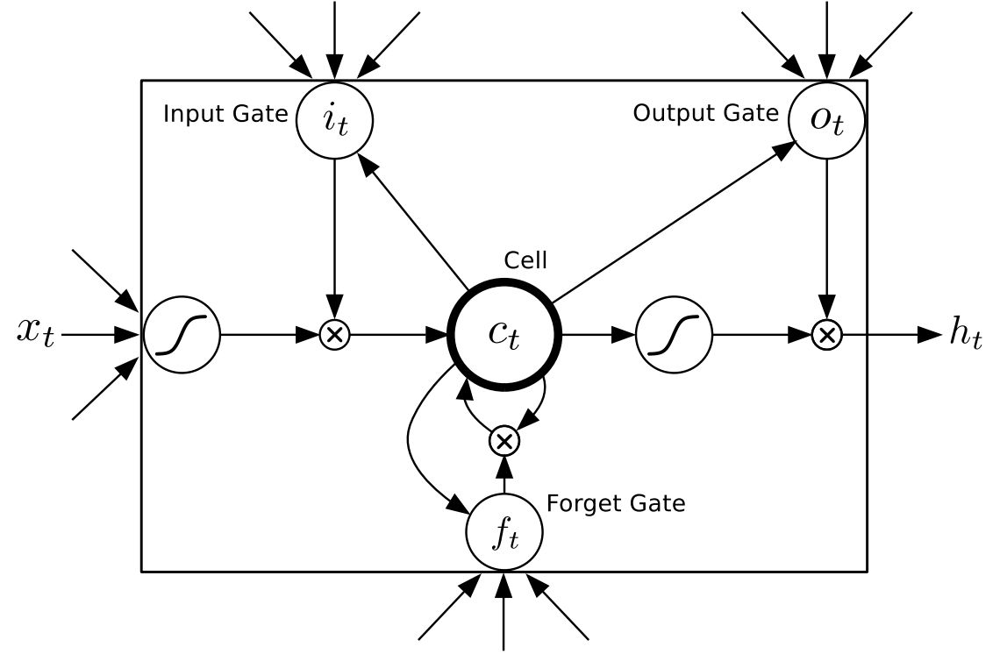
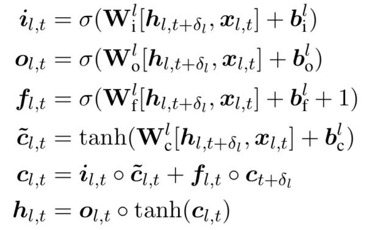

# 第8章 循环神经网络

## 8.1 循环神经网络简介

1. RNN源于1982年由Saratha Sathasivam提出的Hopfield Network
2. RNN主要用途：处理和预测序列数据
3. RNN Cell的输入：1. 输入； 2. 状态

4. RNN结构中的参数在不同时刻是共享的

5. 序列过长会导致优化时出现梯度消失问题(vanishing gradient problem)

## 8.2 长短时记忆网络(LSTM)结构

1. RNN存在长期依赖(long-term dependencies)

要预测的词离相关的上下文片段过远时，有效信息可能已经遗忘掉了.

2. LSTM用于应对长期依赖问题

3. LSTM于1997年由Sepp Hochreiter和Jurgen Schmidhuber提出

4. LSTM的结构可以总结为：三门一状态，三门(遗忘门、输入门、输出门)，一状态(用于做长期依赖)

5. 遗忘门： 忘记没用的信息

6. 输入门： 补充新记忆

7. 输出门： 更新状态

 

 

## 8.3 循环神经网络的变种

### 8.3.1 双向循环神经网络和深层循环神经网络

#### 双向神经网络(Bidirectional RNN)

#### 深层循环神经网络(Deep RNN)

### 8.3.2 循环神经网络的dropout(只在深层循环神经网络的不同层之间进行dropout)

## 8.4 循环神经网络样例应用

### 8.4.1 自然语言建模(PTB)

### 8.4.2 时间序列预测(sin)

#### 附录：

1. [http://colah.github.io/posts/2015-08-Understanding-LSTMs/](http://colah.github.io/posts/2015-08-Understanding-LSTMs/)
2. [On the difficulty of training Recurrent Neural Networks](http://cn.arxiv.org/abs/1211.5063v2)